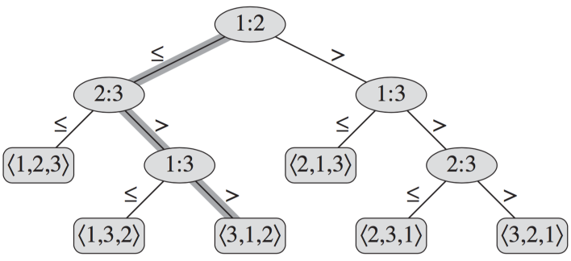

# Notas de algoritmos de ordenamiento, última parte

##Cota inferior para ordenamientos por comparación

Para ordenar tres valores, ¿cuántas comparaciones tenemos que hacer? Contando el caso "else" como una comparación, veamos el siguiente árbol de comparaciones posibles, a fin de tener ordenados tres valores.

Siguiendo el camino señalado: ``1:2`` significa compara ``A[1]`` con ``A[2]``, si es _menor o igual_, entonces revisamos la comparación ``2:3``, si resulta que ``A[2]`` es mayor que ``A[3]``, entonces comparamos ``1:3``, si resulta que ``A[1] > A[3]``, entonces la permutación que dá como resultado la lista ordenada de valores en el arreglo será ``<3, 1, 2>``. Esto es, el arreglo ordenado será

    A[3], A[1], A[2]

Como se observa, un algoritmo de ordenamiento por comparación debe seguir por lo menos, un camino desde la raíz hasta una hoja. Las hojas contienen las permutaciones posibles para los índices del arreglo de tres elementos a ordenar.

En general, sabemos que el número de permutaciones de ``n`` elementos es ``n!``. También sabemos que un árbol binario de ``h`` niveles contiene no más de ``2^h`` hojas. Entonces un árbol de decisión como el anterior con ``L`` hojas alcanzables, cumplirá:

``n! <= L <= 2^h``

Para saber el mínimo número de pasos que un algoritmo de comparacion debe seguir, basta saber la altura de su árbol de comparaciones.

Tomando logaritmos, esto implica que:

    h >= lg(n!)   ; de la 2a desigualdad,
    h = Omega(n lg n)   ; de la fórmula de Stirling

Dado que *Heapsort*, *Merge* y otros tardan ``O(n lg n)``, estos se les llama *algoritmos óptimos de comparación*.

Veremos un par de algoritmos que no utilizan la metodología de comparar los elementos a ordenar.

##Ordenamiento por conteo
Por supuesto, los datos no pueden ser tan generales como con los anteriores algoritmos (por cierto, hemos usado enteros, pero los elementos del arreglo pueden ser cualquier cosa comparable). Para el caso de ordenamiento por conteo asumimos que los ``n`` elementos a comparar están en el rango ``0`` a ``k``. 